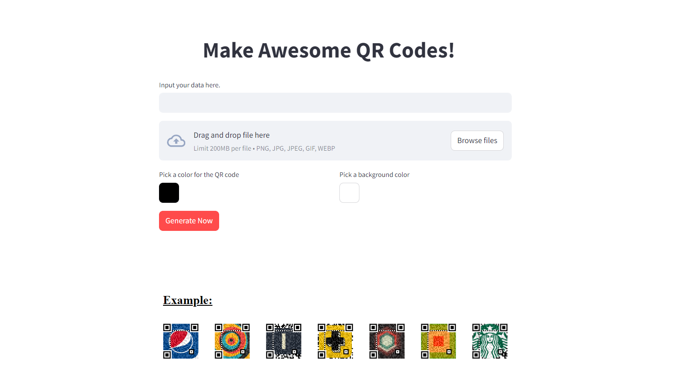

# Awesome QR Codes Generator

Welcome to the Awesome QR Codes Generator, a Streamlit-based application that simplifies the creation of customized QR codes. Generate QR codes with text input, optional background images, and color customization, then download them instantly. Explore our showcase directory for examples of creatively customized QR codes.

## Features

- ***Customization Options***: Input text for QR codes, upload background images, and choose colors for both the QR code itself and the background.
- ***Instant Download***: Download your generated QR codes directly from the app interface.
- ***Example Showcase***: View examples of QR codes with different customizations from our showcase directory.

## Screenshots

### Website Interface



## Usage

1. **Input Data**: Enter the text you want to encode into a QR code.
2. **Upload Image**: Optionally upload an image to use as a background for your QR code.
3. **Color Selection**: Choose colors for the QR code and background using color pickers.
4. **Generate**: Click the "Generate Now" button to create your customized QR code.
5. **Download**: Once generated, download your QR code with a single click.

## Showcase Examples

|          QR Code 1           |          QR Code 2           |
|:----------------------------:|:----------------------------:|
|  |  |


|          QR Code 3           |          QR Code 4           |          QR Code 5           |
|:----------------------------:|:----------------------------:|:----------------------------:|
|  |  |  |


## Installation

To run the Awesome QR Codes Generator locally:

1. Clone this repository:
   ```bash
   git clone https://github.com/Nafi7393/Awesome-QR-Codes-Generator.git
   cd Awesome-QR-Codes-Generator
   ```

2. Install dependencies:
   ```bash
   pip install -r requirements.txt
   ```

3. Start the Streamlit app:
   ```bash
   streamlit run main.py
   ```

## Contributing

Contributions are welcome! Please fork this repository and create a pull request with your improvements.
